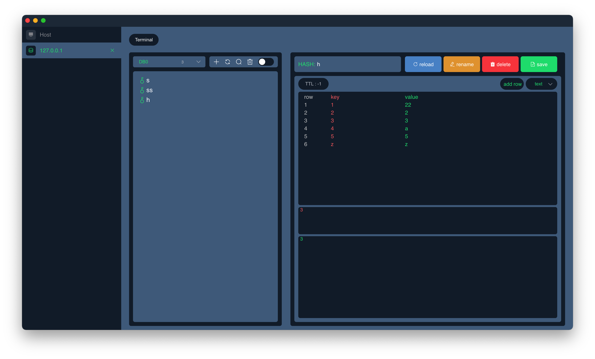

<!--  	 -->


<br/>


[](https://github.com/itpika/knight/releases)
[](https://github.com/itpika/knight/blob/master/LICENSE)

-----

```
A neat redis desktop visualization program that supports Windows, Linux, and MAC operating systems
Currently in the initial 1.0 version, can build binary executable program, the function is not perfect, temporarily only view key, add key, and command line function
```
## Install
```
npm install
```

### Build an executable program
-   window: yarn dist-win
-   mac: yarn dist-mac
-   linux: yarn dist-linux

### Compilation run
```
npm run serve
```

### Preview




## LICENSE
MIT
## Location
- github: https://github.com/itpika/knight-redis