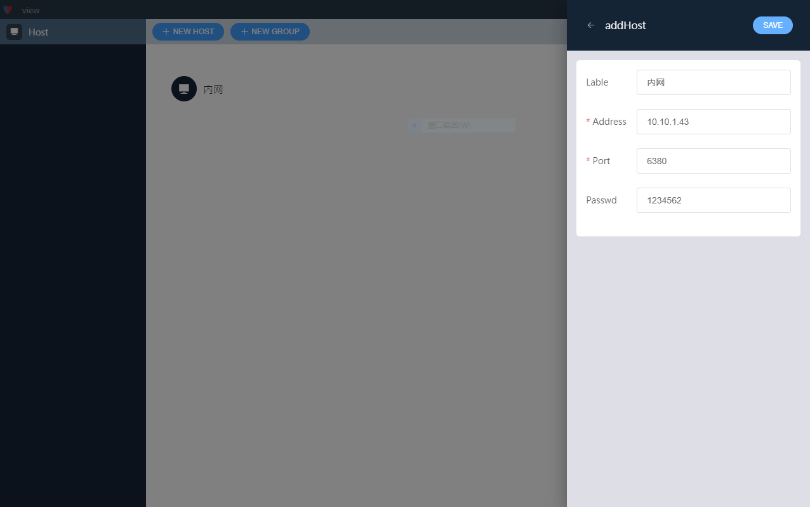
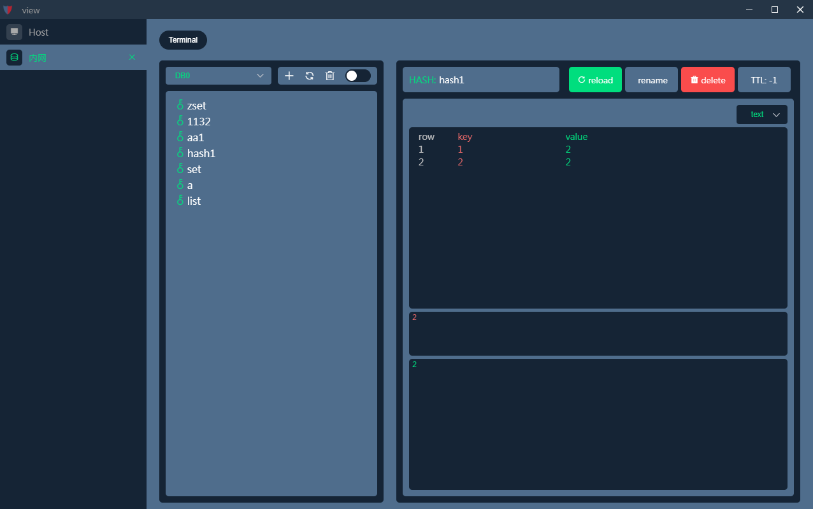

&emsp;&emsp;&emsp;&emsp;&emsp;&emsp;&emsp;&emsp;&emsp;&emsp;


# knight
```
一款整洁的redis桌面可视化程序，支持windows、linux、mac操作系统
目前处于初始1.0版本，可构建二进制可执行程序，功能还不完善，暂时只有查看key，添加key，和命令行功能
```
## 安装
```
npm install
```

### 构建对应操作系统版本
-   window: yarn dist-win
-   mac: yarn dist-mac
-   linux: yarn dist-linux

### 编译启动和热重载
```
npm run serve
```

### 预览




## LICENSE
MIT
## Location
- github: https://github.com/itpika/knight